# IF3110_Pengembangan Aplikasi Berbasis Web

## *Tubes1_Kelompok 8*

## **Table of Contents**
* [Program Description](#program-description)
* [Required Program](#required-program)
* [Installation Guide](#installation-guide)
* [Execution Guide](#execution-guide)
* [Implementation Screenshots](#implementation-screenshots)
* [Progress Report](#progress-report)
* [Workload Distribution](#workload-distribution)

## **Program Description**

## **Required Program**

## **Installation Guide**

## **Execution Guide**

## **Implementation Screenshots**

### Home Page
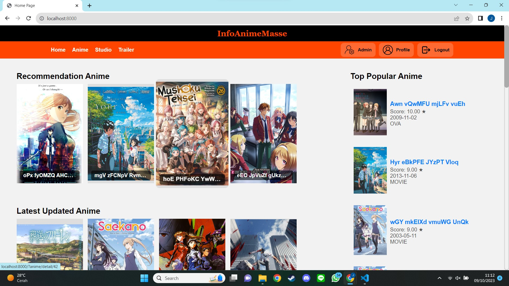

### Home Page : Responsive
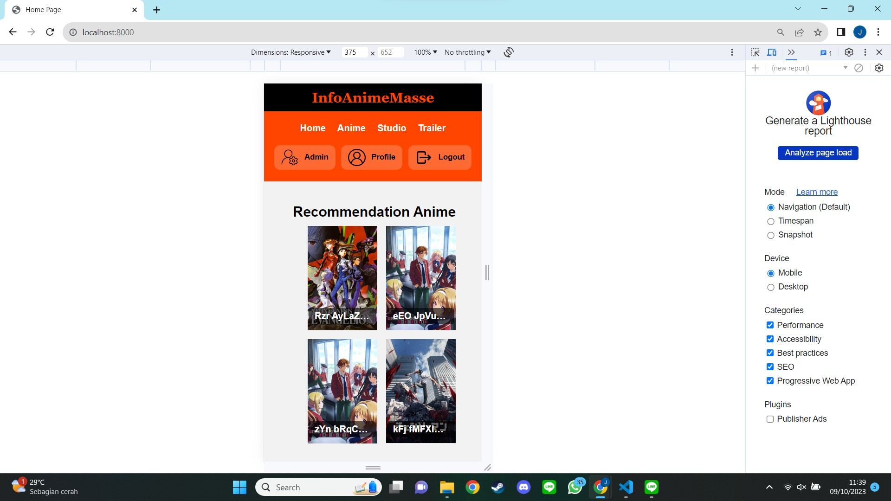

### Anime List Page
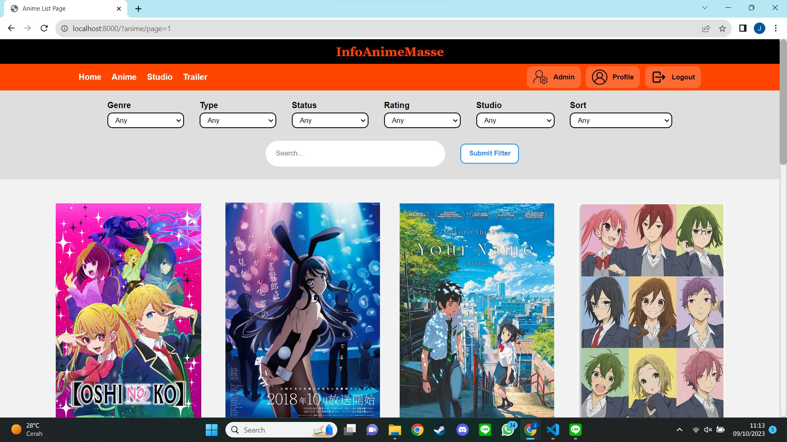

### Anime List Page : Responsive
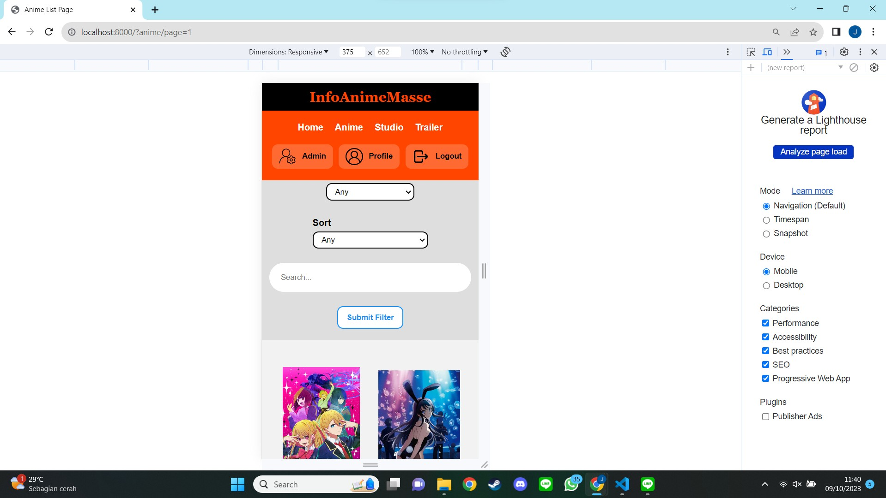

### Anime Details Page
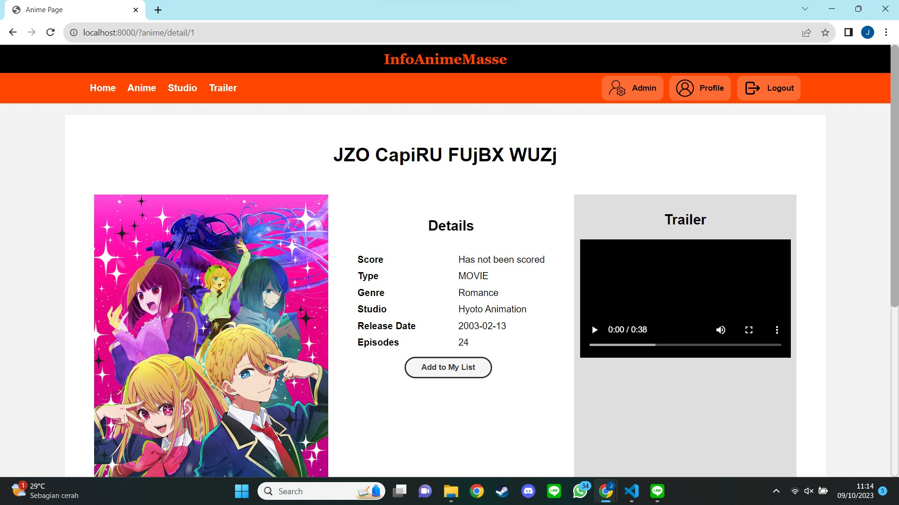

### Studio List Page
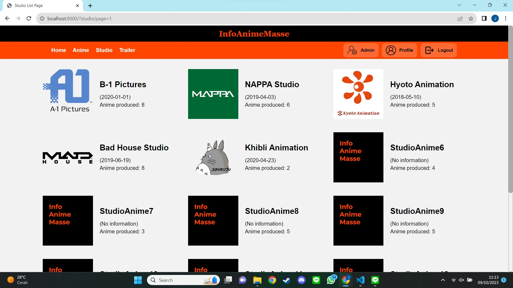

### Studio List Page : Responsive
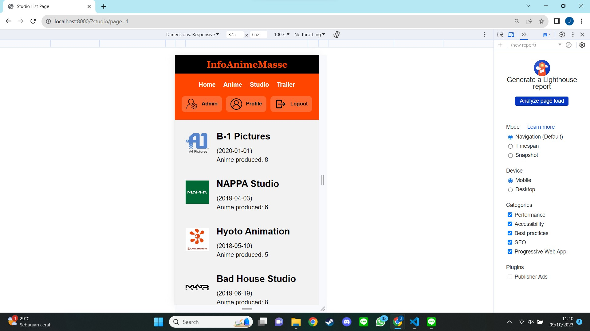

### Studio Details Page
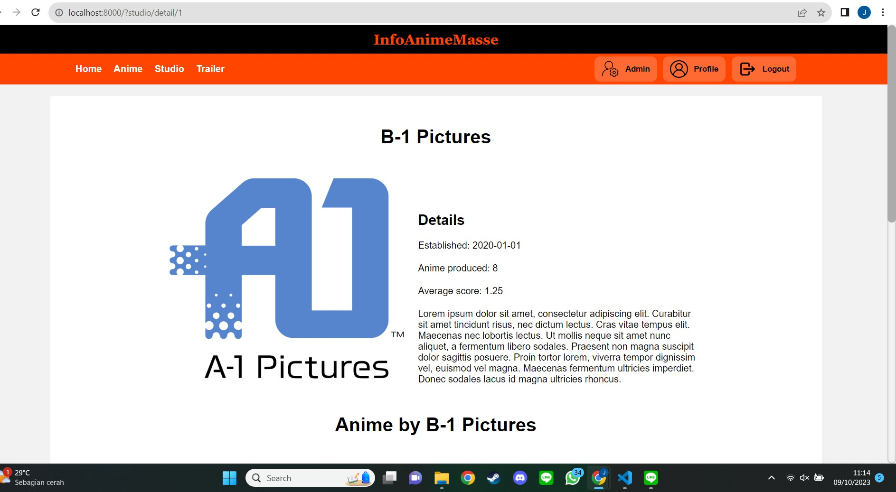

### Trailer List Page
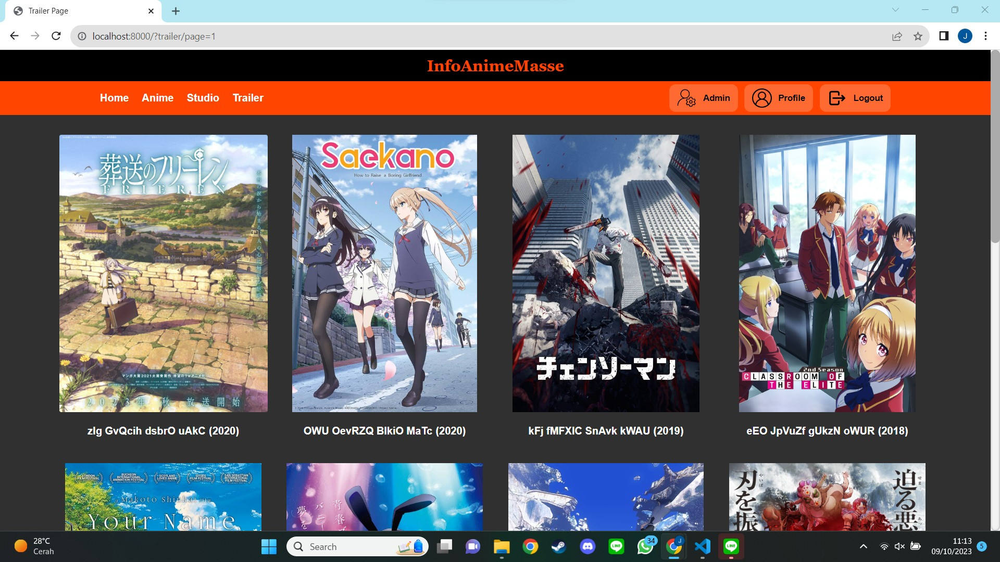

### Trailer List Page : Responsive
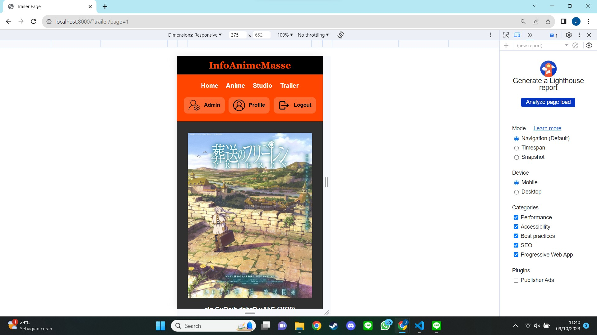

### Trailer Video Page
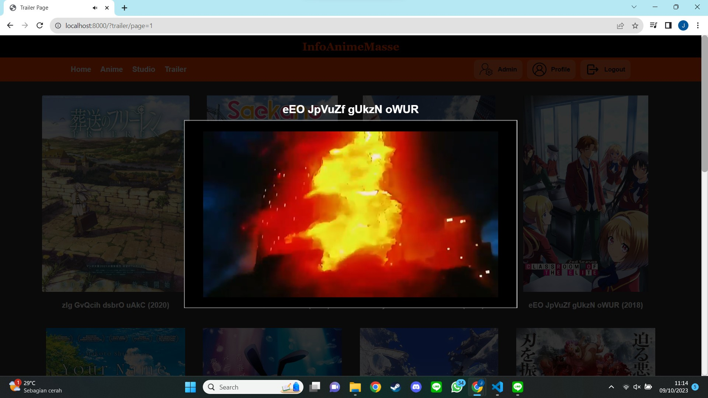

### Admin Page
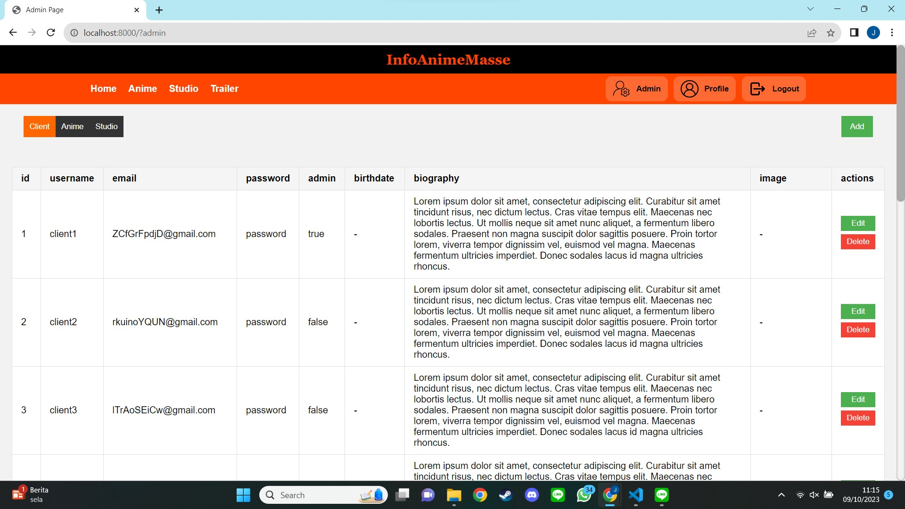

### Profile Page
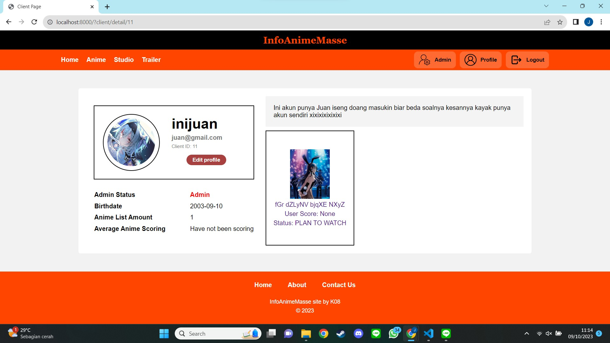

### Client Anime List Page
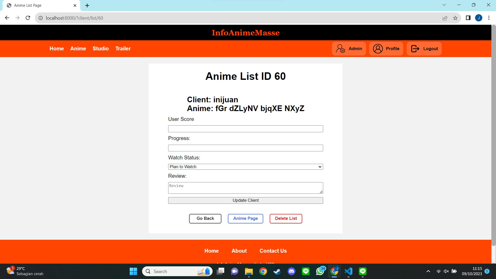

### Login Page
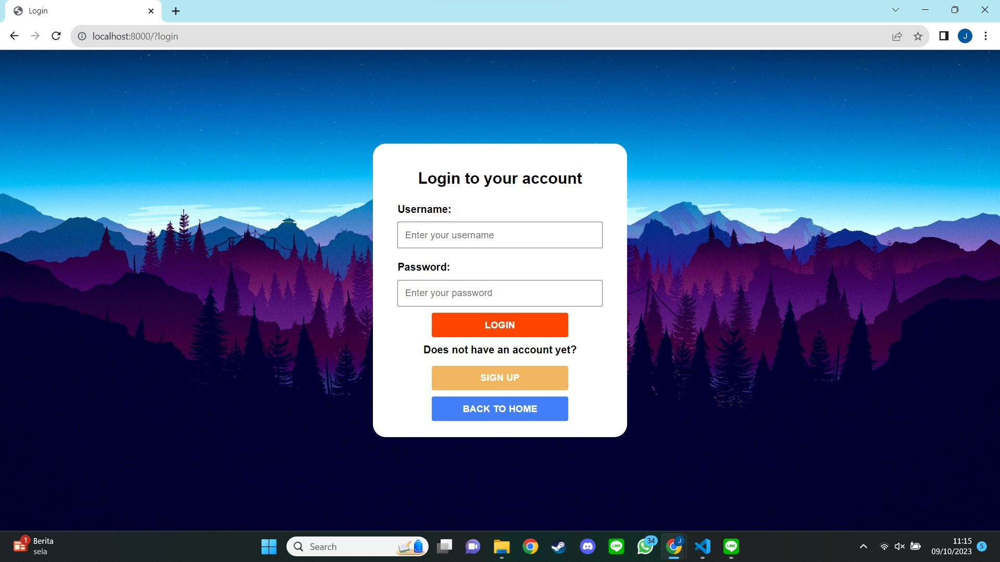

### Signup Page
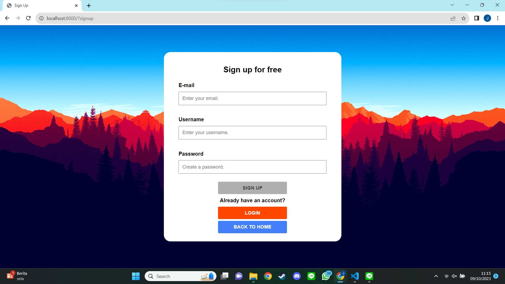

## **Workload Distribution**
| Name                     | Student ID | Client-side | Server-side |
|--------------------------|------------|-------------|-------------|
| Irfan                    | 10023176   | <ul> <li> Figma design <li> Login Page </ul>  | - |
| Bagas Aryo Seto          | 13521081   |  <ul> <li> Navbar and Footer <li> Home Page <li> Admin Page <li> Anime Detail Page <li> Studio Detail Page </ul> | <ul> <li> Schema design <li> Database Tables Implementation <li> Admin Page: Client CRUD <li> Admin Page: Anime CRUD <li> Admin Page: Studio CRUD </ul>|
| Juan Christopher Santoso | 13521116   | <ul> <li> Anime List Page <li> Studio List Page <li> Trailer Page <li> Profile Page <li> Login Page <li> Signup Page <li> Error Page <li> Client Anime List Page <li> Search, Filter, and Pagination Display <li> Responsive Design </ul> | <ul> <li> All API <li> All Controllers <li> Database Constraints Implementation <li> Data Searching and Seeding Implementation <li> All Models and DB Connection <li> All Routing Mechanism <li> ENV Loader <li> Repository Setup <li> Search Implementation <li> Filter Implementation <li> Pagination Implementation <li> Docker Setup and Implementation  <li> Login and signup authorization <li> AJAX on Signup </ul> |
