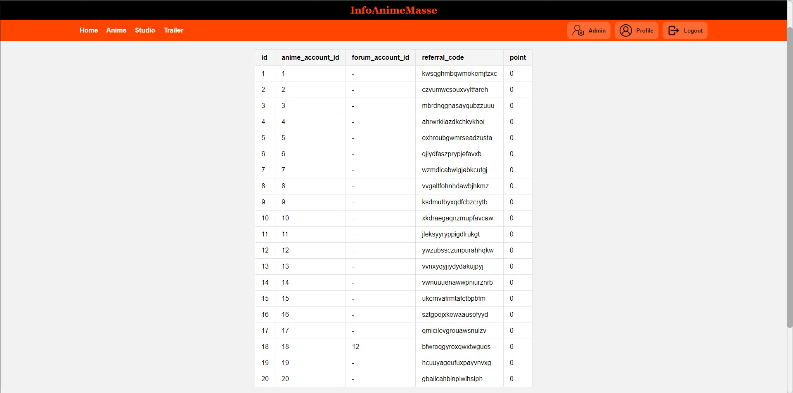

# IF3110_Pengembangan Aplikasi Berbasis Web

## *Tubes1_Kelompok 8*

## **Table of Contents**
* [Program Description](#program-description)
* [Required Program](#required-program)
* [Installation Guide](#installation-guide)
* [Execution Guide](#execution-guide)
* [Implementation Screenshots](#implementation-screenshots)
* [Progress Report](#progress-report)
* [Workload Distribution](#workload-distribution)
* [Additional](additional)

## **Program Description**
**InfoAnimeMasse** is a web based application that allows user to track and rate anime series that they watch. User could search, add to list, give rating, give reviews to the anime in the system.

## **Program Requirement**
| Client-Side | Server-Side | Database | Other|
|-------------|-------------|----------|-------|
| HTML, CSS, Java Script | PHP | PostgreSQL | Docker |


## **Installation Guide**
1. Clone this repository with the following command: 
```
git clone https://gitlab.informatika.org/if3110-2023-01-08/if-3110-tugas-besar-1-wbd.git
```
2. Make sure that you have installed docker in your device.
3. Create an `.env` file by duplicating the `.env.example`. Fill in the blank spot with the needed data of your device
4. Copy the `.env` file and insert it into the `/app/setup` folder


## **Execution Guide**
1. Run the following command in the terminal of the directory
```
docker-compose up --build
```
2. The application will be launched in the URL:  `http://localhost:8000`.


## **Implementation Screenshots**

### Home Page


### Home Page : Responsive


### Anime List Page


### Anime List Page : Responsive


### Anime Details Page


### Studio List Page


### Studio List Page : Responsive


### Studio Details Page


### Trailer List Page


### Trailer List Page : Responsive


### Trailer Video Page


### Admin Page


### Profile Page


### Client Anime List Page


### Login Page


### Signup Page


## **Workload Distribution**
| Name                     | Student ID | Client-side | Server-side |
|--------------------------|------------|-------------|-------------|
| Irfan                    | 10023176   | <ul> <li> Figma design <li> Login Page </ul>  | - |
| Bagas Aryo Seto          | 13521081   |  <ul> <li> Navbar and Footer <li> Home Page <li> Admin Page <li> Anime Detail Page <li> Studio Detail Page </ul> | <ul> <li> Schema design <li> Database Tables Implementation <li> Admin Page: Client CRUD <li> Admin Page: Anime CRUD <li> Admin Page: Studio CRUD </ul>|
| Juan Christopher Santoso | 13521116   | <ul> <li> Anime List Page <li> Studio List Page <li> Trailer Page <li> Profile Page <li> Login Page <li> Signup Page <li> Error Page <li> Client Anime List Page <li> Search, Filter, and Pagination Display <li> Responsive Design </ul> | <ul> <li> All API <li> All Controllers <li> Database Constraints Implementation <li> Data Searching and Seeding Implementation <li> All Models and DB Connection <li> All Routing Mechanism <li> ENV Loader <li> Repository Setup <li> Search Implementation <li> Filter Implementation <li> Pagination Implementation <li> Docker Setup and Implementation  <li> Login and signup authorization <li> AJAX on Signup </ul> |


## **Additional**
| Name                     | Student ID | Functionalities |
|--------------------------|------------|-------------|
| Irfan                    | 10023176   |             |
| Bagas Aryo Seto          | 13521081   |             |
| Juan Christopher Santoso | 13521116   | <ul> <li> API for Reference CRUD <li> Admin for Reference <li> Pagination for Admin Page <li> Connection to SOAP <li> Increasing point mechanism <li> Decreasing point mechanism </ul>|

### Admin Page for Reference
